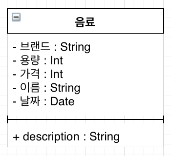
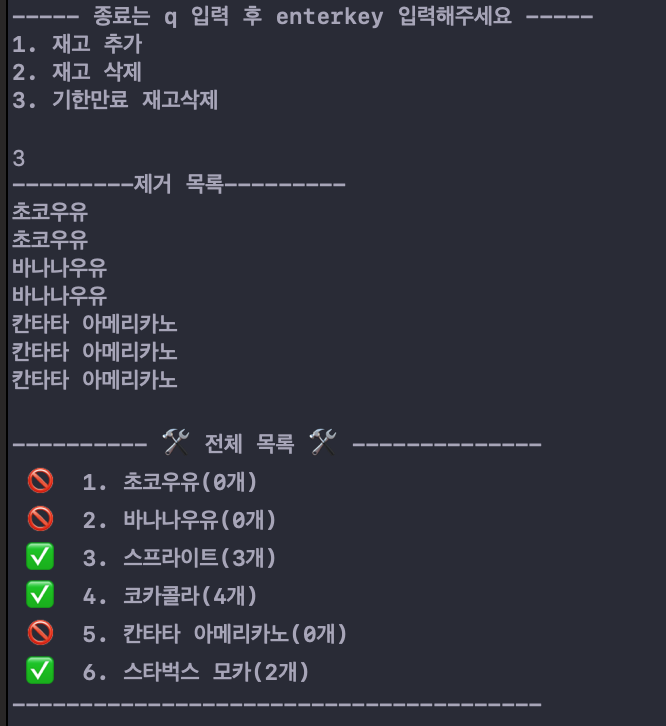

# swift-vendingmachine

- [swift-vendingmachine](#swift-vendingmachine)
    - [음료 클래스 설계](#%EC%9D%8C%EB%A3%8C-%ED%81%B4%EB%9E%98%EC%8A%A4-%EC%84%A4%EA%B3%84)
    - [실행결과 :](#%EC%8B%9C%EB%82%98%EB%A6%AC%EC%98%A4)
    - [SwiftLint](#swiftlint)

### 음료 클래스 설계

* 음료 클래스 전체 설계

----

### 실행결과 : 
* 관리자 모드 : 

      
    
    * 관리자 모드에서 재고 추가  
    
          
    
    * 관리자 모드에서 재고 삭제
    
        
    
    * 관리자 모드에서 기한 만료 재고 삭제
    
        
    
----

  * 사용자 모드 : 
  
      
      
      * 사용자 모드에서 금액 1500 추가 
      
        
      
      * 사용자 모드에서 음료 구매시 잘못 입력하였을때 안내 문구
      
        
      
      * 사용자 모드에서 음료 구매
      
         

    
  ----  
  
### SwiftLint

* SwiftLint 적용 : 
  * CocoaPods 설치하고 Xcode 나의 프로젝트에 적용하기 : 
  https://github.com/conyconydev/conyconydev.github.io/blob/master/_posts/ios/2019-05-07-CocoaPodsUseXcode.md
  * SwiftLint Xcode 나의 프로젝트에 적용하기 :
  https://github.com/conyconydev/conyconydev.github.io/blob/master/_posts/ios/2019-05-08-SwiftLintApplication.md
